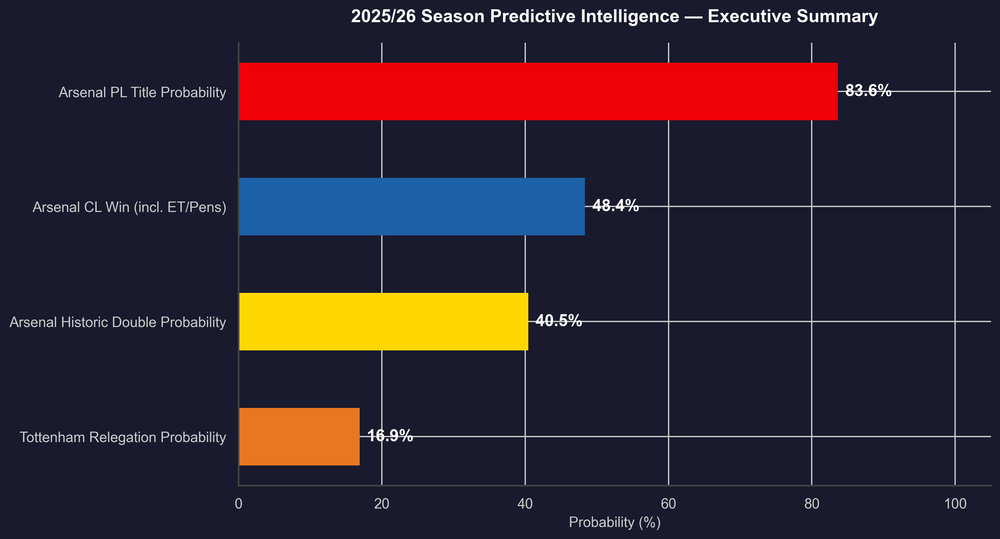
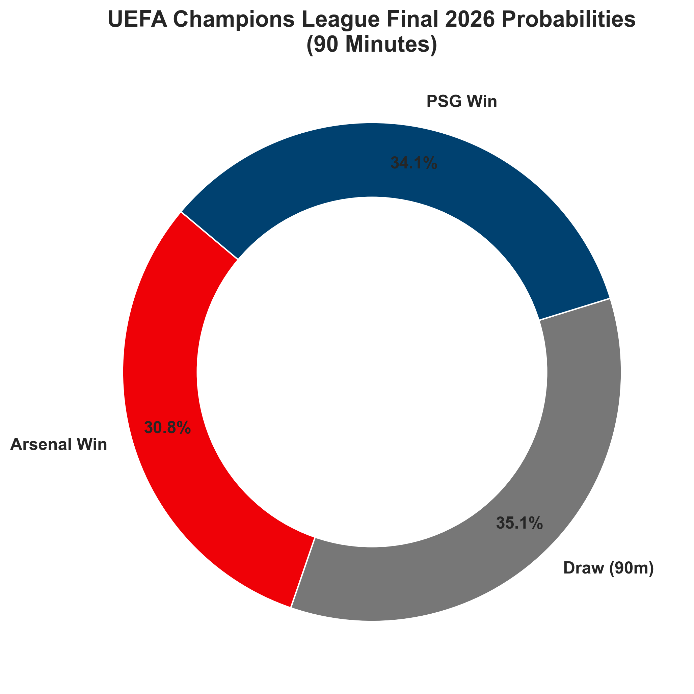
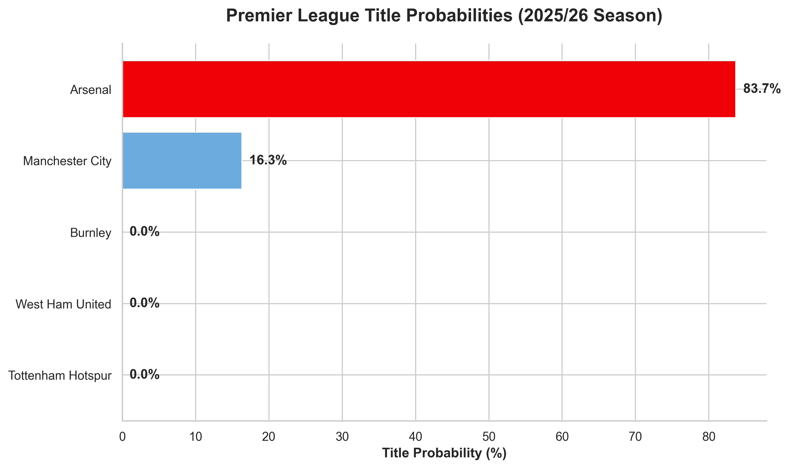

# Arsenal & Tottenham Predictive Intelligence Platform



> **Production-grade predictive modeling for the 2025/26 Premier League & UEFA Champions League seasons.** Built to the rigorous standards of elite sports analytics, this system leverages a dynamically tuned, multi-league Dixon-Coles Poisson model with a Contextual Adjustment Engine encoding injuries, fatigue, and motivation asymmetry.

---

## 2025/26 Season Predictions

| Objective | Probability |
|---|:---:|
| Arsenal — Premier League Title | **83.71%** |
| Arsenal — CL Final Win *(incl. ET/Penalties)* | **47.08%** |
| Arsenal — Historic Double *(PL + CL)* | **39.41%** |
| Tottenham — Relegation Risk | **16.92%** |

Full technical analysis: [REPORTE_EJECUTIVO_2526.md](REPORTE_EJECUTIVO_2526.md)

---

## Champions League Final — Arsenal vs PSG



**Puskas Arena, Budapest (Neutral Venue)**

| Scenario | Arsenal | Draw | PSG |
|---|:---:|:---:|:---:|
| 90 Minutes | 29.3% | 35.6% | 35.1% |
| **Incl. ET/Penalties** | **47.1%** | — | **52.9%** |

---

## Premier League Title Race



---

## Core Architecture

The statistical engine extends the classic **Dixon & Coles (1997)** methodology with modern enhancements:

1. **Multi-League Time-Decay Log-Likelihood** — Trains simultaneously on PL + Ligue 1 (657 matches). Exponential decay weighting $w_k = e^{-\alpha^* \cdot t_k}$ with $\alpha^* = 0.0100$ (optimized via grid search on held-out validation set).
2. **Contextual Adjustment Engine** — Bayesian-style priors encoding injuries, fatigue, and motivation. Applied separately per team per competition with explicit scientific justification for every coefficient.
3. **Neutral Venue Calibration** — CL Final simulated with `home_adv = 0.0` at Puskas Arena.
4. **Bivariate Poisson Correction (ρ)** — Dixon-Coles τ adjustment for structurally under-dispersed low-scoring matches (0-0, 1-0, 0-1, 1-1).
5. **Monte Carlo Season Simulator** — 100,000 full-season iterations producing complete position probability distributions.

---

## Data Engineering & MLOps

| Standard | Implementation |
|---|---|
| Schema Validation | Pandera enforced at ingestion for both PL and Ligue 1 |
| Type Safety | Python 3.12+ with full `mypy` strict mode |
| Linting & Formatting | `Ruff` — replaces black/flake8/isort |
| Test Coverage | `pytest` with ≥80% coverage on core mathematical modules |
| Dependency Management | `uv` — fast, reproducible, lockfile-enforced |

---

## Quick Start

```bash
# Clone and setup
git clone https://github.com/JuanjoRestrepo/Arsenal_Spurs.git
cd Arsenal_Spurs

# Install all dependencies
uv sync

# 1. Ingest multi-league data (PL + Ligue 1)
uv run python -m arsenal_spurs_prediction.data.ingestion

# 2. Run the full pipeline (tunes alpha, trains model, applies context, runs 100K simulations)
uv run python -m arsenal_spurs_prediction.pipeline

# 3. Generate visualizations
uv run python src/arsenal_spurs_prediction/visualizations.py

# 4. Export HTML dashboard
uv run python -m arsenal_spurs_prediction.export_dashboard
```

---

## Output Files for Power BI

| File | Description |
|---|---|
| `data/processed/current_standings.csv` | Current PL standings |
| `data/processed/remaining_fixtures_probs.csv` | 1X2 probabilities per remaining match |
| `data/processed/cl_final_probs.csv` | CL Final probabilities (90min + ET) |
| `data/processed/simulation_probabilities.csv` | Full Monte Carlo distribution (100K iterations) |
| `data/processed/executive_summary.csv` | 4 headline KPIs for metric cards |

---

## Next Steps (V3)

- Migration to a fully **Bayesian framework** (`PyMC`) for posterior credible intervals
- Live injury feed integration via external API
- Market calibration against **Pinnacle closing lines** for model validation
- Automated daily pipeline with scheduled re-fitting

---

## References

- Dixon, M. & Coles, S. (1997). *Modelling Association Football Scores.* Applied Statistics.
- Mohr, M. et al. (2005). *Fatigue in soccer: A brief review.* Journal of Sports Sciences.
- Grinsztajn, L. et al. (2022). *Why tree-based models still outperform deep learning on tabular data.* NeurIPS.

---

*Model trained on data through May 15, 2026.*
